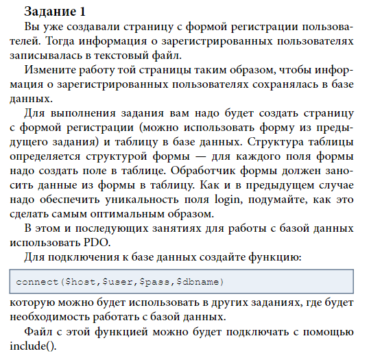
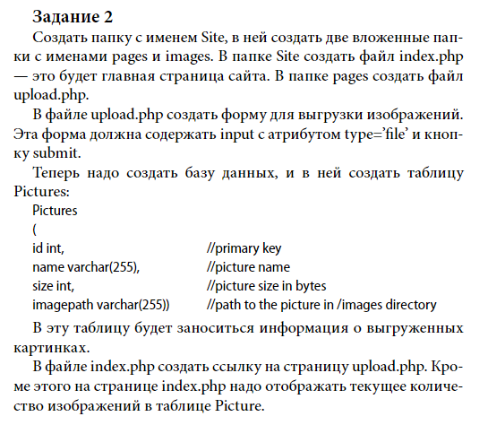
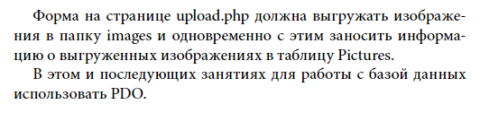
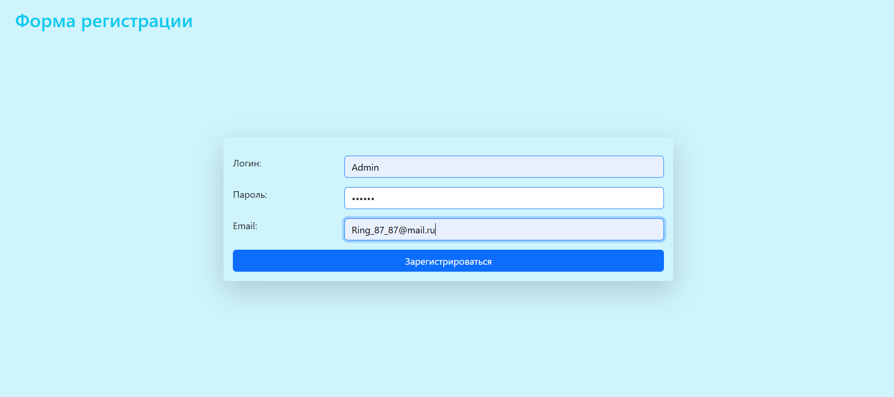
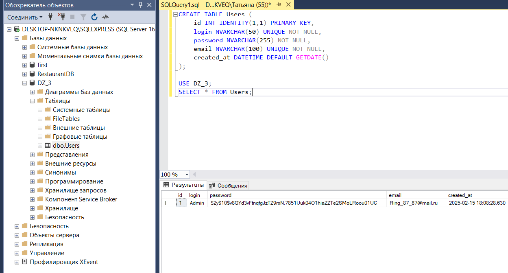

### Запуск и установка 
---
Запустить БД (SSMS)
Запустить сервер (nginx, php-cgi)

Заранее создать базу данных DZ_3 и пустую таблицу Users

Открываем в браузере:

registration_form.php

----Задача 2
Заранее создать таблицу Pictures

Открываем в браузере:
http://localhost/php_dz3/Site/index.php
http://localhost/php_dz3/Site/pages/registration_form.php